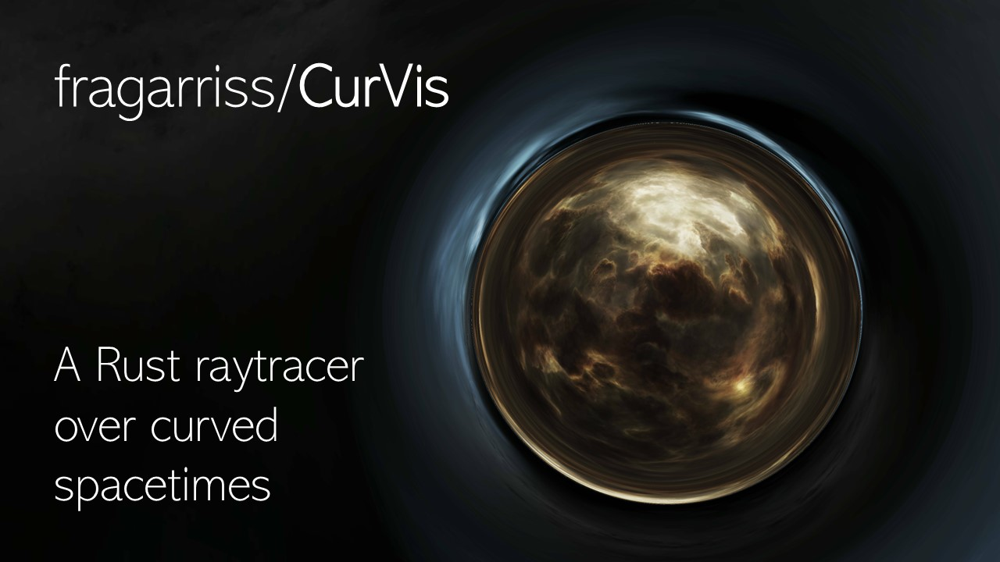

# CurVis

A Raytracer on Curved Spacetimes.

Author: Francesco Garrisi

## Description

CurVis is a Rust Package that allows rendering images and videos on curved spacetimes, by simulating the propagation of light using equations from General Relativity.

Out of the shelf, the CurVis binary can render images of wormholes such as the [Ellis wormhole](https://en.wikipedia.org/wiki/Ellis_wormhole) or the wormhole seen in the movie Interstellar.

CurVis is based on the work of O. James et al., 2015, (https://doi.org/10.1119/1.4916949) and was inspired by [this YouTube video](https://www.youtube.com/watch?v=V7e-1bRpweo) from Scott Manley.

## Installation

If you are cloning the library from GitHub, you will need to compile the source code before you can run it.

If you have cargo installed on your system, you can use a terminal to navigate to your local repository and run

``cargo build --release``

This will compile the source code and place the executable within *./target/release*.

## Basic Usage

### Creating an image of a wormhole

Creating your first image of a wormhole is very easy with a terminal. You need to provide two 360 degree images of your choice and then run

`curvis image <path_to_background_image_1> <path_to_background_image_2> <path_to_output_folder>`

This will create an image and put it in the output folder. By default, the output folder is the current working directory, and the corresponding argument can be omitted.

### Creating a video

The command to create a video is similar:

`curvis video <path_to_background_image_1> <path_to_background_image_2> <path_to_output_folder>`

This will create a *tmp* folder within the output folder and will put there the frames for assemblying the video. The current version of curvis is not assemblying the frames in a video, yet. As before, the output folder can be omitted from the arguments; *tmp* will be created within the working directory.

### Command Line Interface

Run `curvis --help` for more information on the general syntax of CurVis' command-line-interface.

## 360 degree images

Currently CurVis only supports rectangular images (and not skyboxes). Try to find high resolution images for the best outcome.

If you need inspiration for the choice of images, here are some suggestions:
* [NASA's Deep Star Maps](https://svs.gsfc.nasa.gov/4851/)
* [European Southern Observatory - 360 Panorama](https://www.eso.org/public/images/archive/category/360pano/)

Some EVE online wallpapers also work very nicely!

## Settings

CurVis rendering can be customized by providing various settings files.

Settings files have to be .toml files.

When these files are not passed, CurVis uses default settings that are found in the */settings/defaults* folder within the CurVis package itself. You can use these files as reference for your curstom settings files to be used with CurVis.

There are four different settings files that can be passed to CurVis:

1. simulation settings
2. camera settings
3. image / video settings
4. metric settings

### Simulation Settings

Simulation settings specify parameters for the algorithm that calculates the ray propagation in space.

### Camera Settings

Camera settings specify the resolution of the rendered images, the field of view of the camera.

### Image Settings

Active with the ``curvis image`` subcommand. You can use these to specify the camera position and orientation in space.

### Video Settings

Active with the ``curvis video`` subcommand. There you can specify the frame rate of the video and you can specify where to find a .csv file that describes the camera movement in space. More on this later on.

### Metric Settings

With metric settings, you can decide which space-time is simulated and its parameters.

## Camera Paths

When rendering a video, you need to specify how the camera moves in space-time.
You can do it by creating .csv files that contain this information and then provide them to CurVis through the video settings described above.

In the */paths* folder you can find two examples. The "path_through.csv" file specifies a path that moves the camera through the wormhole. The "path_orbit.csv" file specifies a camera that orbits the wormhole.

## Known Issues and Limitations

* CurVis currently supports only simulates metrics with spherical symmetry (preventing, for instance, the simulation of rotating black holes, that have cylindrical symmetry).
* The video algorithm does not produce a video but creates only png frames that are saved in a *tmp* folder.
* The background image of the negative-l space is flipped.
* Background images cannot be rotated.
* Sometimes the video rendering algorithm panics on the last frame.
* Artefacts are visibile at the boundary of wormholes, especially at lower resolutions.
* Documentation is very limited; no tutorials.
* Single-threaded.

## Wishlist

* Black holes!
* Multithreading.
* Using a single setting files to pass all the arguments.